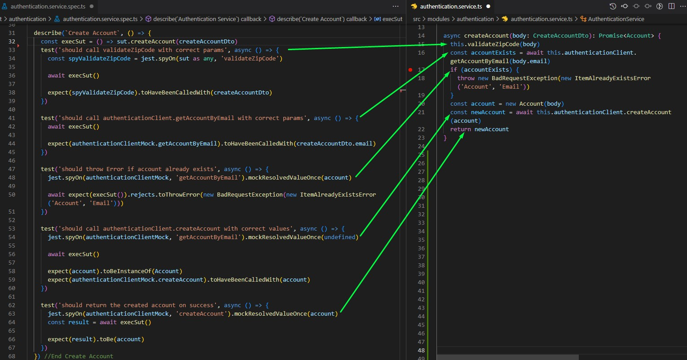
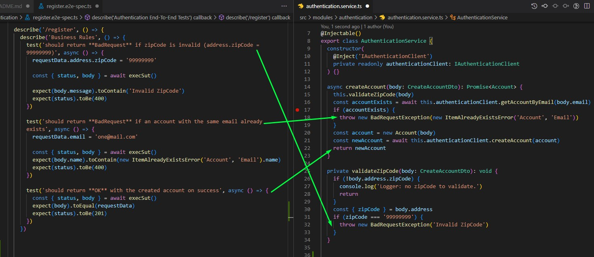

# NestJS - NodeJS - Backend Testing

# Objectives

The main objective of this project is to keep it as a knowledge base about backend testing, including tips and test examples, covering the majority of the most common use cases with unit, integration, and end-to-end tests.

**Application**

</br>

The application is an authentication API where you call a third party authentication service (scr/infrastructure/AuthenticationClient). A mock service was made for the authentication client. This app have an authentication route (/register), where a new account can be created and a route to retrieve all accounts (/getAllAccounts). 

The main goal of the application was to include the usecases that i wanted to test.


## Structure

- NestJs backend using Typescript
- Jest as the main testing framework
- @faker-js/faker to generate random data

Test files:

- files .spec.ts: unit tests
- files .test.ts: integration tests
- files .e2e-spec.ts: end to end tests

### Setup

1. clone the git repository
1. run npm install

### To run the tests

1. open the terminal and run the command of the chosen test type

- `npm run test:unit` - unit tests
- `npm run test:int`  - integration tests
- `npm run test:e2e`  - end to end tests


###  To reach the endpoints:

1. If youre using vsCode, install the extension REST Client : https://marketplace.visualstudio.com/items?itemName=humao.rest-client
1. go to ``src/modules/authentication/authentication.http`` and send the requests


```
POST http://localhost:3003/register
content-type: application/json

{
    "name": "Test name",
    "email": "email@email.com",
    "age": 9,
    "address": {
       "country": "BR",
       "zipCode": "99999991"
    }
}

###

GET http://localhost:3003/getAllAccounts
content-type: application/json

{}
```

</br>


# Tests

Some concepts and tips to have in mind when writing tests:

- Validate only one scenario per test: minimize the number of asserts
- Tests should be Stateless: all elements in a test should return to the initial state after each test.

</br>

**Arrange > Act > Assert**
- Arrange – setup the test required elements (variables, objects, databases, mocks, spies, etc)
- Act – perform the action that will generate the behavior that will be tested
- Assert – verify the result of the action

</br>

**F.I.R.S.T**
- **F**ast - test should be fast. When tests run slow, you won’t want to run them frequently.
- **I**ndependent - Tests should not depend on each other. Tests should be able to run in any order.
- **R**epeatable - Tests should be repeatable in any environment. If your test aren’t repeatable in any environment, then you’ll always have an excuse for why they fail.
- **S**elf-Validating - Tests should have a boolean output. You should not have to read through a log file to tell whether the tests pass.
- **T**imely - Tests need to be written in a timely fashion. Unit test should be written just before the production code. If you write tests after the production code, then you may find the production code to be hard to test

</br>

Have fun making tests :sunglasses:

## Unit Tests

Unit tests are focused on testing the logic path inside a code unit. This unit is usually a method. Tests should have none or just a few external dependencies. Most dependencies can be simulated through mocks. 

If the test has too many dependencies, then an integration test may be better.

Some tips:

1. Check if the test covers all the logic of the method. Most tests should fail if you implement any change of logic inside the tested code, allowing the code to be refactored with fewer chances of creating bugs.
2. It's not necessary to always mock everything. If creating the mock demands too much effort and time, then it might be better to use the functionality directly.
3. It's not necessary to create unit tests for all external dependencies. If you don't trust them, then you shouldn't be using them.
4. The % percentage of coverage should not be the sole reference guiding a test strategy. Real code coverage will only be reached if item 1 from this list is followed.

Unit test example:

In this example, if you change the logic or comment any block of code, the related tests will fail.



</br>

## Integration Tests

Integration tests are very similar to unit tests, but they use the real implementation of the dependencies instead of mocks. They are important because the implementation of a software can change, containing breaking changes. If you mock everything, your tests wont fail and the bug might escape to production.

Some examples of integration tests:

- Test a repository + database interaction
- Test a call to a external service


</br>

## End-To-End Tests (e2e)

End-to-end tests are focused in testing a entire process flow.

In APIs, that consist in making a request and getting the expected response depending in the scenario tested.

E2E tests should cover all business rules and all validations. The business rules are usually in the usecases (services) and the validations in the controller. 

Most of the business rules test scenarios are **returns** and **throws** in the usecase.

Example:

